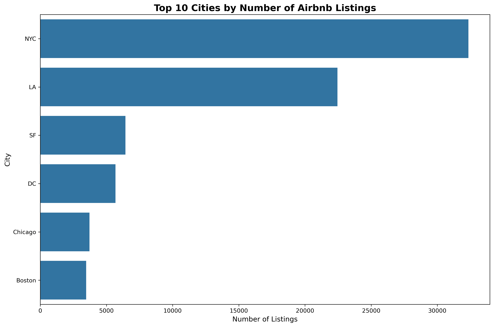
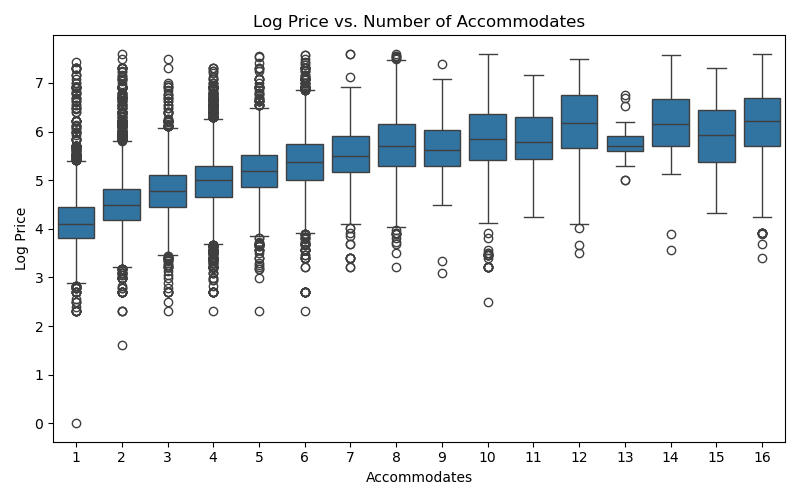
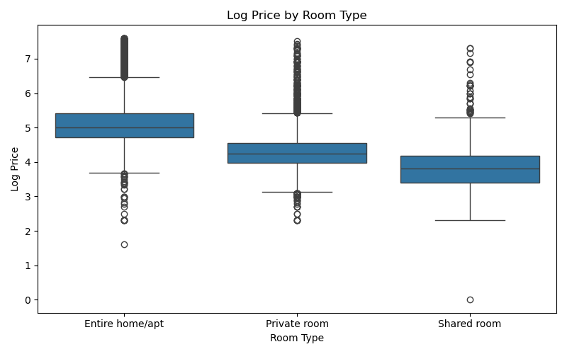
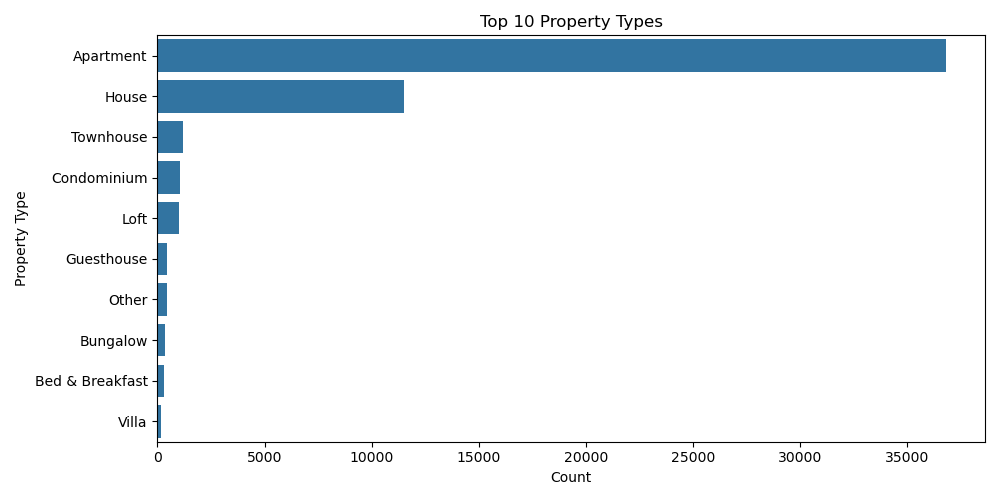
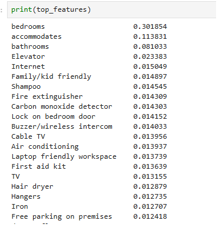

# Airbnb Price Optimizer

**Manish Kumar**

**UC Berkeley MLAI Program Capstone Project**

**(Module 20) Initial Baseline model & Exploratory Data Analysis**: [basic_model_eda_airbnb_pricing.ipynb](basic_model_eda_airbnb_pricing.ipynb)

**Final Model**: [final_model/final_models_airbnb_pricing.ipynb](final_model/final_models_airbnb_pricing.ipynb)

### Data Source

The dataset was obtained from Kaggle: [Airbnb Price Dataset](https://www.kaggle.com/datasets/rupindersinghrana/airbnb-price-dataset/data)

* **Name**: Airbnb Price Dataset
* **Source**: Scraped or aggregated from Airbnb listings across major U.S. cities
* **Total Rows**: ~74,000+ entries
* **Purpose**: Enable modeling and analysis of nightly Airbnb prices using property features

### Exploratory Data Analysis (EDA)

1. **Data observation by city**: Grouped the data by city and narrowed down the analysis to NYC and LA for focused modeling
2. **Feature correlation analysis**: Verified correlations between main features and log-price to ensure dataset suitability for model training
3. **Data cleaning**: Removed duplicate entries and null values
4. **Feature selection**: Removed unnecessary columns for faster processing
5. **Detailed analysis**: Examined price vs. accommodates, price by room type, property type distribution, and top 20 zipcodes by city
6. **Amenities breakdown**: Analyzed amenities and their correlation with log-price
7. **Amenities feature engineering**: From 119 distinct amenities, selected top features for modeling to avoid overfitting, reduce dimensionality, and improve interpretability
    * Removed standard amenities (common across most listings)
    * Removed rare amenities (low frequency)
    * Ranked amenities by correlation with price
    * Kept the top 20 most predictive features

* **Observation Images/Plots**

* **Top20 Features**

### Baseline Model Training

Implemented a simple yet effective regression algorithm to predict log-price based on available features.

* **Baseline Model**: Random Forest
* **MAE**: 0.2901
* **RMSE**: 0.3994
* **R²**: 0.6666

#### First Iteration Results

**MAE 0.29**: On average, the predicted log-prices are off by 0.29 units. Since we're using log-price, this translates to a ~34% average relative error in raw price (exp(0.29) ≈ 1.34).

**RMSE 0.3994**: Slightly higher than MAE, indicating some larger errors/outliers in prediction. RMSE penalizes these more heavily.

**R² 0.6666**: The model explains ~66.7% of the variance in log-price. This is a solid baseline, suggesting that the input features (property details, location, top amenities) have meaningful predictive power.

The error range is acceptable, especially given that the prediction target is log-transformed, making interpretation robust to outliers.

#### Areas for Improvement

* Adding more predictive features (e.g., reviews, seasonal effects, event calendars)
* Experimenting with other model architectures
* Feature engineering and selection optimization
* Hyperparameter tuning 
